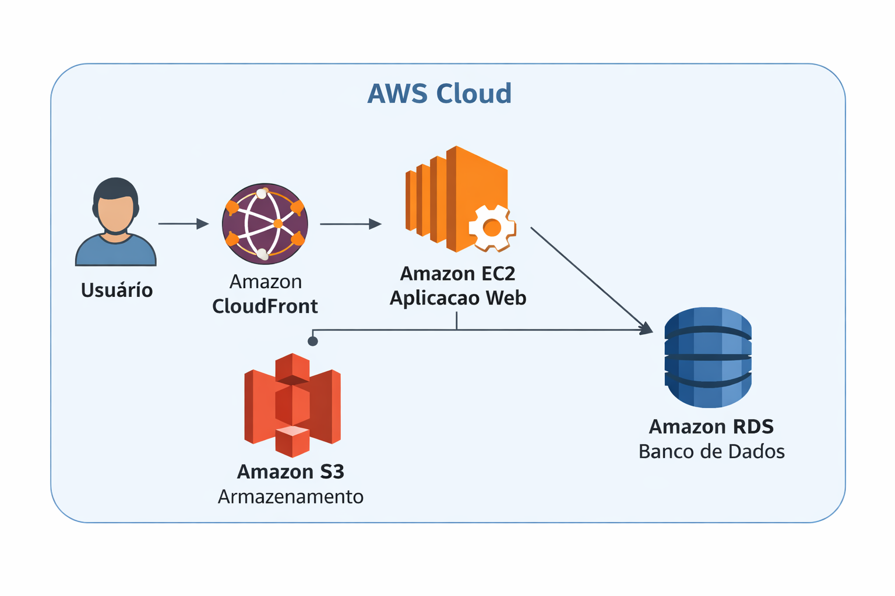

# 💊 PharmaTech Solutions - Arquitetura AWS para Farmácia Virtual

## 📌 Descrição do Projeto

Este projeto apresenta a implementação de uma arquitetura em nuvem utilizando serviços da AWS para suportar uma **farmácia virtual fictícia**, chamada **PharmaTech Solutions**.

O objetivo principal é demonstrar, na prática, como utilizar serviços da AWS para construir uma aplicação:

- Escalável
- Segura
- Econômica
- Altamente disponível

---

## 🎯 Objetivos

- Reduzir custos com infraestrutura física
- Garantir alta disponibilidade da aplicação
- Melhorar desempenho e escalabilidade
- Aplicar boas práticas de arquitetura em nuvem

---

## 🏗️ Arquitetura da Solução

A aplicação foi estruturada utilizando os seguintes serviços da AWS:

- **Amazon EC2** → Hospedagem da aplicação  
- **Amazon RDS** → Banco de dados gerenciado  
- **Amazon S3** → Armazenamento de arquivos estáticos  
- **AWS IAM** → Controle de acesso e segurança  

---

## 📊 Diagrama de Arquitetura (Visual)



---

## 📊 Diagrama Alternativo (Mermaid)

```mermaid
flowchart LR

    user([👤 Usuário])

    cf[🌐 CloudFront]
    ec2[🖥️ EC2 - Aplicação]
    rds[(🗄️ RDS - Banco de Dados)]
    s3[(📦 S3 - Arquivos)]

    user --> cf --> ec2
    ec2 --> rds
    ec2 --> s3
